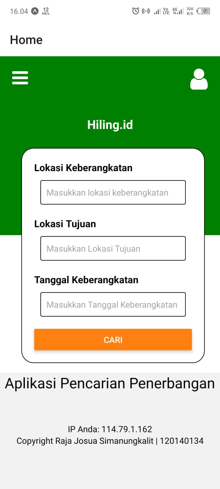

# Tugas Individu 4 PAM Redux Thunk & Saga

## Cara menginstall aplikasi (dalam mode pengembangan)
1. install module
```
npm install
```

2. install expo
```
npm start
```

3. build to apk ( android )
```sh 
eas build --platform android
```

## Link Aplikasi
https://expo.dev/artifacts/eas/mTVU3njc4eYYPWNHojJaUy.apk

## Bentuk Aplikasi

1.  Tampilan Awal Aplikasi <br>
     <br>
    Tampilan awal, pencarian jadwal pesawat aplikasi akan melakukan request ke api Ip dan menampilkannya di HomeScreen , <br>

2.  Tampilan Hasil Pencarian Akan terlihat seperti pada gambar berikut ini :
     <br>
    Aplikasi akan menampilkan halaman data penerbangan
