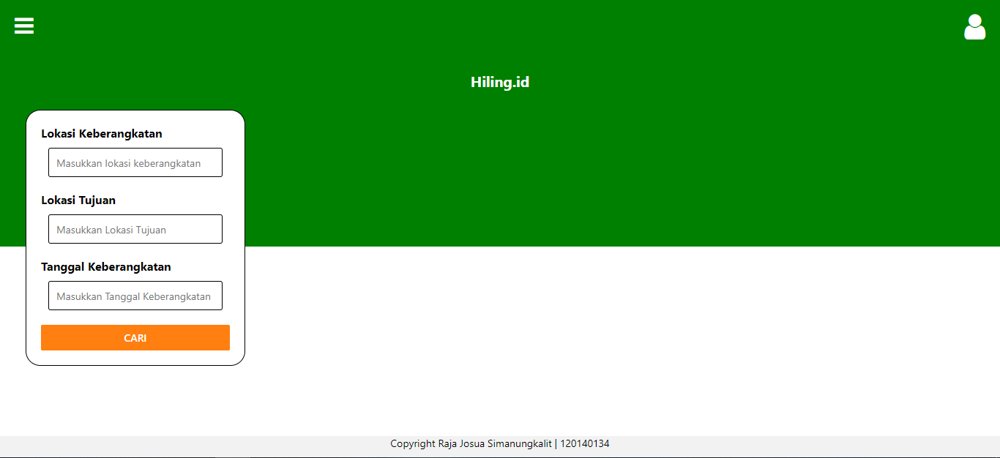
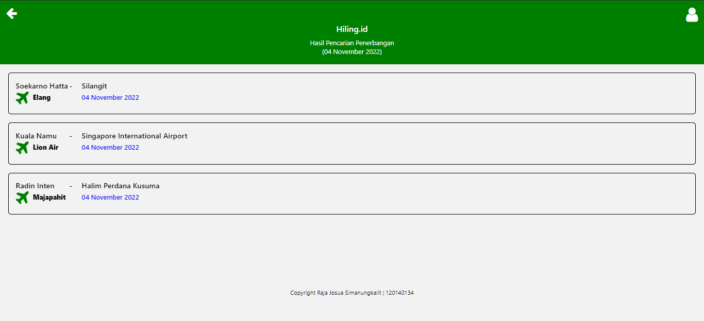

# Tugas Individu 3 PAM

## Cara menginstall aplikasi (dalam mode pengembangan)
1. install module
```
npm install
```

2. install expo
```
npm start
```

3. build to apk ( android )
```sh 
eas build --platform android
```

## Bentuk Aplikasi

1.  Tampilan Awal Aplikasi
     <br>
    Tampilan awal, pencarian jadwal pesawat , <br>

2.  Tampilan Hasil Pencarian Akan terlihat seperti pada gambar berikut ini :
     <br>
    Aplikasi akan menampilkan halaman data penerbangan
